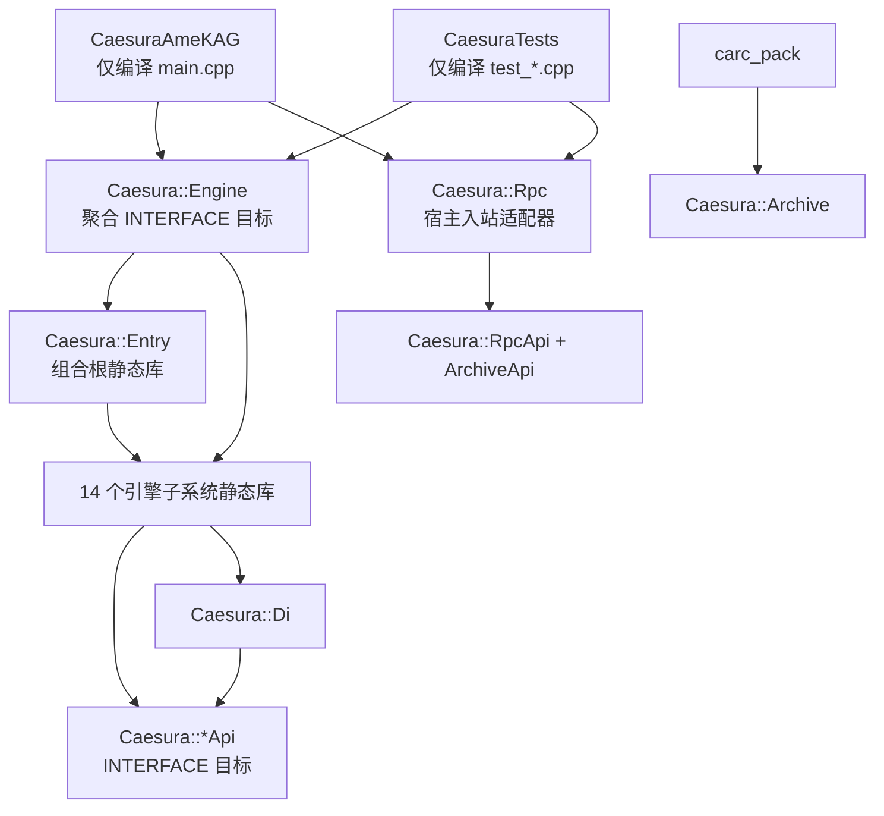

# 引擎架构与构建拓扑

## 架构决策

Caesura 采用“内部模块静态库 + 最终单一可执行文件”的混合结构：

- 15 个普通子系统与 `entry` 组合根分别形成静态库，共 16 个内部模块静态库
  （api-stats 的 "Module libraries" 计 15 是因为它以 `src/*/api/` 目录计数，
  `entry` 无 `api/` 子目录、不产生接口，故不计入）。
- 除 `entry` 外，每个模块都有对应的 API-only `INTERFACE` 目标，共 15 个 API 目标。
- 每个子系统的生产源码只编译一次，便于约束依赖和复用测试。
- 对外交付仍是 `CaesuraAmeKAG` 单一可执行文件，不引入 DLL ABI、部署或版本兼容负担。
- 测试链接与正式程序相同的模块库，不再重复编译生产源码。
- `carc_pack` 直接复用归档模块，不维护第二套 CARC/Ed25519 源文件清单。

目标定义集中在 `cmake/CaesuraModules.cmake`。

## CMake 目标分层



除 `entry` 外的 15 个普通模块各有两个目标：

| 目标 | 类型 | 职责 |
|---|---|---|
| `Caesura::<Module>Api` | `INTERFACE` | 表达接口头、公共编译条件和接口级依赖 |
| `Caesura::<Module>` | `STATIC` | 只拥有该模块的生产 `.cpp`，链接实现所需依赖 |

`entry` 是组合根，没有单独的 API 目标。`Caesura::Engine` 不编译源码，只聚合
`entry` 与 14 个运行时引擎模块。`Caesura::Rpc` 由最终程序和测试显式链接，避免
入站传输层反向进入引擎核心。

## 模块源码归属

| 模块目标 | 源码目录 | 说明 |
|---|---|---|
| `Caesura::Archive` | `src/archive` | CARC、加密、签名、增量归档 |
| `Caesura::Audio` | `src/audio` | SoLoud 与空音频后端 |
| `Caesura::Debug` | `src/debug` | 日志、热重载、调试协议 |
| `Caesura::Di` | `src/di` | BackendRegistry、配额、线程断言状态 |
| `Caesura::Entry` | `src/entry` | Engine 生命周期与具体后端组合 |
| `Caesura::Input` | `src/input` | SDL 输入路由 |
| `Caesura::Job` | `src/job` | 多线程任务系统 |
| `Caesura::Live2D` | `src/live2d` | 空动画后端及可选 Cubism 实现 |
| `Caesura::MiniGame` | `src/minigame` | 3D 小游戏后端及其内嵌着色器 |
| `Caesura::Platform` | `src/platform` | SDL3/Null 平台后端与移动适配 |
| `Caesura::Render` | `src/render` | bgfx/Null 渲染、纹理、视频、粒子 |
| `Caesura::Resource` | `src/resource` | 资源提供者、解码、异步加载 |
| `Caesura::Rpc` | `src/rpc` | 编辑器 HTTP/RPC 服务 |
| `Caesura::Script` | `src/script` | Lua VM、状态与绑定；`SaveBinding` 归属本模块 |
| `Caesura::Steam` | `src/steam` | Steamworks 后端 |
| `Caesura::Storage` | `src/storage` | 存档、迁移、本地/云提供者 |

`src/render/EmbeddedShaders_SPIRV.cpp` 是唯一不单独进入目标的 `.cpp`；它由 `EmbeddedShaders.cpp` 文本包含，重复编译会产生重复定义。

## 16 模块职责详表（api 接口 / 关键实现 / 数据流进出）

> 每个模块仅通过 `src/<module>/api/I*.h` 对外暴露符号；实现细节（具体类、第三方
> 依赖）对其他模块不可见。31 个接口盘点、逐接口方法数见 `docs/api/api-stats.md`
> （自动生成）；依赖矩阵见 `docs/design/backend-registry-dependency-guide.md`。

| 模块 | API 接口（api/ 目录） | 关键实现 | 数据流进出 |
|---|---|---|---|
| **archive** | `IArchiveReader` `IArchiveWriter` `ICryptoEngine` | `CARCReader` `CARCWriter` `CRLManager` `CarcAssetProvider` `CryptoEngine`(AES-256-GCM + Ed25519) `DeltaCARC` | 入：资源路径/CARC 文件流、加密密钥、nonce 复用注册表；出：解密解压后的资产缓冲、加密/签名的归档写回；`CarcAssetProvider` 作为资源提供者链的一环供 `AssetManager` 消费 |
| **audio** | `IAudioBackend` | `SoLoudAudioEngine`（3 总线 BGM/Voice/SE）`NullAudioBackend` | 入：`play_bgm/play_se/play_voice` 等 L/KAG 命令、fade/volume 控制；出：音频流输出、voice 完成事件（每帧 `consumeVoiceCompletions` 泵给 Lua `_onVoiceComplete`） |
| **debug** | `IDebugManager` | `DebugManager`（结构化日志+环形缓冲+子系统统计）、`DebugProtocol`（调试器状态机）、`HotReload` | 入：`DEBUG_*/` 宏（零开销直调）、RPC 调试命令（断点/步进/暂停恢复）；出：日志、`getDebugState` DTO、热重载触发 |
| **di** | `ITextureBudget` `ISandboxQuota` `IDeviceLostListener` | `BackendRegistry`（22 个非拥有服务槽位）、`TextureBudget`（6 档自适应）、`SandboxQuota` | 入：各后端注册/查询、纹理分配/释放、Lua 资源操作配额；出：预算拒绝、配额扣减、设备丢失通知（`notifyDeviceLost/notifyDeviceRestored`） |
| **entry** | —（组合根，无独立 API 目标） | `Engine` + `EngineConfig`（move-only） + `ErrorUI` + `StartupScripts` + `StartupValidation`；拆分 `Engine_Backends/Engine_Assets/Engine_Gpu/Engine_LuaRegistry` | 入：具体后端指针、Lua 配置表；出：创建+注册全部后端、初始化分四阶段、逆序关停、错误 UI |
| **input** | `IInputRouter` | `InputRouter`（SDL 事件→KAG/Game 焦点路由 + resize 回调） | 入：SDL 键盘/鼠标/手指事件；出：`_KAG_onClick`/按键全局、焦点切换、点击合并（每帧至多一次 coalesced click） |
| **job** | `IJobSystem` | `JobSystem`（线程池+优先级+主线程回调）、`NullJobSystem`（测试同步） | 入：加载/解码任务（无共享状态）；出：`pollMainThreadJobs` 主线程消费回调、`onComplete` |
| **live2d** | `IAnimationBackend` | `NullAnimationBackend`（PNG 降级）、可选 Cubism 实现、`PathConfinement`（路径穿越防护） | 入：model/motion/expression 命令；出：`render` 帧绘制、纹理句柄（`setLayerTexture`） |
| **minigame** | `IMiniGameBackend` | `BgfxMiniGameBackend` + `NullMiniGameBackend` + `MiniCollision`(sweep-and-prune) + `MiniGeometry` | 入：`enter->update->render->leave` 生命周期 + JSON 场景 + Lua `mini_game` 绑定；出：3D 场景渲染、碰撞判定结果 |
| **platform** | `IPlatformBackend` `IMobileAdapter` | `SDL3PlatformBackend` + `NullPlatformBackend` + `MobileAdapter`（触摸→鼠标/滚轮映射、方向事件） | 入：窗口创建、原生句柄、SDL 事件泵、时间基准；出：`getTicksMs`、窗口句柄（供 bgfx 初始化）、分辨率 |
| **render** | `IRenderDevice` `ITextureManager` `ILayerManager` `IParticleSystem` `IVideoPlayer` `IGpuMonitor` `IMeshRenderer` | `BgfxRenderDevice`+分拆实现（Draw/Blit/Effects）`BgfxDeviceCore`(视图管线) `BgfxQuadBatch`(批次) `RTTManager` `TextRenderer`(FreeType/CJK/ruby) `TextureManager`(预算+LRU) `LayerManager`(BG/FG/MSG 三层+dirty) `ParticleSystem` `VideoPlayer`(pl_mpeg/FFmpeg) `GpuMonitor`(自适应降级) `SmaMeshRenderer`(GPU 蒙皮) + 内嵌 shader（DXBC/GLSL/Metal/SPIR-V） | 入：Lua 绘制命令（submit_batch/render_text/blit/postfx）、纹理加载、视频帧；出：bgfx 帧缓冲、RTT 视图、后处理链、截图 readback、GPU 指标 |
| **resource** | `IAssetProvider` `IAsyncLoader` `IResourceGenerationTracker` | `AssetManager` + `ProviderChain`（Dir→CARC 提供者链，优先级+完整性）+ `DirAssetProvider` + `ImageDecoder`(stb) + `AsyncLoader` + `XP3Archive`(KAG3 XP3 读取) | 入：资源路径/URL、异步加载请求；出：解码缓冲（主线程 onComplete 上传 GPU）、代际失效句柄（`invalidate_handles`） |
| **rpc** | `IEditorServer` `IRpcServer` `IRpcDispatcher` | `EditorServer`(HTTP 编辑器端口 9876，25 端点) + `RpcServer`(stdio JSON-RPC，29 方法) | 入：编辑器 HTTP/stdin 请求（eval/run/断点/资产清单/SMA 校验）；出：owner-thread DTO 分发（`unsupported_yieldable_execution` 拒绝直接 yield 主状态） |
| **script** | `ILuaManager` | `LuaManager`(Lua 5.4 VM+指令预算沙箱)、`GameState`(runner会话引用) + `bindings/*.cpp`(KAG/Render/Save/VFX/Sma/Steam/AI/Debug/DevCore/Engine/MiniGame) | 入：Lua 脚本、KAG .ks token（经 tokenizer→scheduler）、RPC eval；出：经 BackendRegistry 触达全部后端；`engine_update/engine_render` 每帧回调、`_CAESURA_CTX` 执行上下文 |
| **steam** | `ISteamBackend` | `SteamBackend`（成就/统计/云存档/overlay，条件编译 `CAESURA_HAS_STEAM`；无 SDK 时 Null 安全默认） | 入：Lua `steam.*` 18 API 调用；出：Steamworks 成就解锁/统计写入/Remote Storage 云文件 |
| **storage** | `ISaveManager` `ISaveProvider` | `SaveManager`(AES-256-GCM + `CAES` 魔数 + schema v1→v5 迁移) `CloudSaveProvider` `HttpCloudSaveProvider` | 入：状态与调用方提供的缩略图文本、存档/读档及云同步请求；出：原子发布的存档文件、云 push/pull；不拥有 GPU 或截图 |


## 组合根与运行时注册

`src/entry/Engine.cpp` 与其拆分实现文件负责具体后端的创建、生命周期编排和
`BackendRegistry` 注册。与脚本、粒子和存档相关的当前关系如下：

| 服务 | 生命周期/所有权 | 注册与访问 |
|---|---|---|
| `LuaManager` | `Engine` 以 `unique_ptr` 持有并负责初始化、关闭 | 初始化后以 `ILuaManager*` 注册，关闭时清空 |
| `HotReload` | `Engine` 以 `unique_ptr` 独占，且成员声明在 Lua 之后 | 不进入 Registry；初始化时借用当前 `lua_State*`，在 Lua 关闭前解绑 |
| `DebugProtocol` | `Engine` 按配置以 `unique_ptr` 持有，构造时借用所属 `HotReload&` | 不进入 Registry；HotReload 后挂载、Lua VM 前解绑；可 yield 协程通过非阻塞状态机暂停，传输只提交 DTO |
| `TextRenderer` / FreeType | `TextRenderer::TTFState` 懒初始化并独占 `FT_Library` 与 `FT_Face` | Render 模块内部 RAII；严格先释放 face 再释放 library，不再由 Engine 管理全局 context |
| `ParticleSystem` | `Engine` 以 `unique_ptr<IParticleSystem>` 持有 | 由组合根创建并注册；VFX 绑定只使用 `IParticleSystem` |
| `NullRenderDevice` / `NullPlatformBackend` | headless 模式下由 `Engine` 以接口 `unique_ptr` 持有 | 具体对象在组合根创建；Registry 只保存非拥有接口指针 |
| `GenerationTracker` | `Engine` 以 `unique_ptr<IResourceGenerationTracker>` 持有 | Script 只通过 Registry 和资源模块 API 失效句柄代际 |
| `TextureBudget` / `TextureManager` | `Engine` 分别以 `unique_ptr<ITextureBudget>`、`unique_ptr<ITextureManager>` 持有 | Render 只经 Registry 获取预算接口；关闭时释放资源并注销 |
| `JobSystem` / `AssetManager` / `AsyncLoader` | `Engine` 按依赖逆序析构要求持有三个实例 | AsyncLoader 接收非拥有 AssetManager 指针；组合根显式排空回调后依次关闭 Async、Asset、Job |
| `SaveManager` | `Engine` 以 `unique_ptr<ISaveManager>` 持有并初始化 | SaveBinding 只经 Registry 访问，关闭时清空注册 |
| `CryptoEngine` | `Engine` 以 `unique_ptr<ICryptoEngine>` 持有 | Archive/Storage 经 Registry 使用加密接口 |
| `SteamBackend` | `Engine` 以 `unique_ptr<ISteamBackend>` 持有；默认使用 Null adapter | 初始化成功后注册为 Registry 服务（当前共 22 个非拥有服务）；Steam Binding 每次从 Registry 解析，关闭时清空 |
| `LayerManager` | `Engine` 以 `unique_ptr<ILayerManager>` 持有；根据真实/Null renderer 选择 GPU 生命周期 | renderer 初始化后注册；shutdown 后立即注销 |
| `SandboxQuotaService` | `Engine` 以 `unique_ptr<ISandboxQuota>` 持有 | Lua 初始化后绑定 VM；音频/纹理释放配额后再解绑并注销 |

`RpcServer` 与 `EditorServer` 不属于 Engine 后端，由 `main.cpp` 以局部 RAII 对象持有。
两种传输都依赖 `IRpcDispatcher`，worker 只提交自包含 DTO 并等待回复；Engine owner
thread 在每帧最前排空队列。关闭时先停止 dispatcher intake 并完成等待者，再停止传输，
最后解绑 DebugProtocol、HotReload 和 Lua。`run` / `eval` 在 managed coroutine 完成前
明确返回 `unsupported_yieldable_execution`，不直接执行 Lua 主状态。

`DebugProtocol` 已用 `Running -> Paused -> ResumePending` 状态机取代 hook 内等待：
可 yield 协程在线 hook 中立即让出，线程安全 mailbox 按 `pauseId` 投递一条恢复命令，
跨暂停延迟命令会被拒绝，Lua owner thread pump 后由宿主显式恢复。暂停协程经 Lua
registry 强引用跨 GC 保活；不可 yield
命中只记录位置并继续执行。Engine 的 owner-thread pump 通过 managed resume 捕获错误并
清理 yielded/return 结果；恢复发生的同一帧禁止普通 Lua 回调。`kag_runner.lua` 的
`start/update/on_click` 统一经过 resume scheduler，并用只读 C 闭包实时查询暂停状态。
canonical source-id 已处理 Lua source 前缀、路径斜杠、绝对/相对路径、`.` / `..` 与
Windows ASCII 大小写；symlink/junction 解析及显式 source root 注入仍是后续增强项。

`EngineConfig` 是 move-only 的所有权转移包。调用方必须使用
`Engine engine(std::move(config))`；`enableDebugger` 随配置移动并控制协议挂载。构造完成后，原配置中的后端指针均为 `nullptr`，
具体对象由 `Engine` 的接口 `unique_ptr` 独占。

初始化失败会在 `init()` 内立即进入幂等回滚。关闭资源管线时保持以下顺序：

1. 停止 Layer、MiniGame 与异步生产者，不再创建新资源；
2. `AsyncLoader::shutdown()`、`AssetManager::shutdown()`、`JobSystem::shutdown()`；
3. Audio 与 TextureManager 释放仍追踪的资源及 Sandbox 配额；
4. 注销并解绑 `SandboxQuotaService` 与 `HotReload`，再关闭 Lua VM；
5. 按逆序关闭其余后端并清空 `BackendRegistry` 非拥有指针。

`SaveBinding.cpp/.h` 位于 `src/script/bindings/`，通过
`BackendRegistry::getSaveManager()` 获取 `ISaveManager`，不直接包含或访问具体
`SaveManager` 实现。

## 启动流程（main.cpp → entry → registry → Lua → kag_runner）

### 3.1 阶段总览

```text
main.cpp
  ├─ 解析 CLI（--headless / --editor / --editor-stdio / --backend / --frames /
  │    --export-replay / --export-dir） + CAESURA_EDITOR_TOKEN 环境变量
  ├─ 向上探测 assets/ 目录并 chdir（保证从任意 CWD 启动都能找到资源）
  ├─ EngineConfig config（move-only 所有权转移包：backends/窗口/headless/editor）
  │    └─ GPU 模式（!headless || editorMode）创建具体后端：
  │         SDL3PlatformBackend / BgfxRenderDevice / SoLoudAudioEngine / BgfxMiniGameBackend
  ├─ Engine engine(std::move(config)) → engine.init()（4 阶段，见下）
  ├─ 分支：
  │    ├─ --editor      → 加载 config.lua + kag/init.lua → lockdown → HTTP 编辑器/stdio RPC
  │    ├─ --headless    → 同上最小加载 → stdio JSON-RPC
  │    └─ 正常游戏       → config.lua → kag/init.lua → validateCarcOnStartup →
  │                        resetInstructionBudget → 入口脚本（config.entry_script，
  │                        默认 ../demo/entry.lua） → 推送 _CAESURA_CONFIG →
  │                        lockdownScriptEnv → engine.run()
  └─ engine.run() 主循环（见 3.3）→ engine.shutdown() 逆序关停
```

### 3.2 Engine::init() 四阶段

`Engine.cpp` 的 init 是**幂等可回滚**的：任一阶段失败立即 `shutdown()` 清理已注册服务。

| 阶段 | 职责 | 关键注册（BackendRegistry `set*`） |
|---|---|---|
| **initPlatformPhase** | 平台/窗口/渲染/音频/输入就绪 | `setPlatformBackend` `setMobileAdapter` `setRenderDevice`（含 `setPreferredBackend`） `setAudioBackend` `setInputRouter`；`DebugManager` 写入 render/audio/input 信息；`setTextureBudget` `setTextureManager` `setAsyncLoader` `setSaveManager` `setParticleSystem` `setLayerManager`；创建 `GpuMonitor` |
| **initScriptingPhase** | Lua VM + 沙箱 + 调试协议 + 绑定 | `setLuaManager`、`setSandboxQuota`（绑定 VM）、`setVideoPlayer`、`registerEngineLuaRegistryServices`（引擎服务表）、`DebugProtocol`（借用 `HotReload`）、Lua 自动存档间隔绑定 |
| **initAssetPhase** | 资源管线 | `setJobSystem` `setResourceGenerationTracker`、`VideoPlayer::setJobSystem`、`AssetManager::init` + `registerDefaultAssetProviders`（Dir→CARC 链） |
| **initOptionalPhase** | 条件后端 + 扩展 | `setSteamBackend`（SDK 可用时） `setCryptoEngine` `setMiniGameBackend`（含输入回调注册）`setAnimationBackend`（Cubism/PNG 降级）`setMeshRenderer`（SMA：真实/Null 选择） |

> 关停顺序与 init 严格相反（见 §4 生命周期表与当前文档正文）：先停 Layer/MiniGame/异步
> 生产者 → `AsyncLoader→AssetManager→JobSystem` shutdown → Audio/Texture 释放资源并解绑
> 配额 → 注销 `SandboxQuota`/`HotReload` → 关 Lua VM → 按逆序清空 Registry 非拥有指针。

### 3.3 Engine::run() 每帧主循环

```text
while (m_running) {
  ownerPump()                    // RPC dispatcher 每帧最前排空队列（managed coroutine）
  pumpDebugger() → publishDebugPauseState()   // 调试协议（暂停/恢复/步进）
  processEvents()                // SDL 事件泵 + 输入路由 + 点击合并（_KAG_onClick）
  consumeDeviceLost() → 恢复    // GPU 设备丢失恢复（recoverFromDeviceLoss）
  dt 计算（0.25s 截断）          // 平台 tick 或 headless 稳态时钟
  hotReload->checkAndReload()    // Lua 未暂停时检查脚本热重载
  jobSystem->pollMainThreadJobs() + asyncLoader->poll()   // 异步完成回调
  Lua 内存预算（80%/95%/100% GC 阶梯 + 300 帧 GC step）
  gpuMonitor->update()           // 自适应质量：写 _CAESURA_GPU_QUALITY/_VFX_ENABLED 等全局
  自动存档计时器
  _KAG_onClick（每帧至多一次 coalesced click）
  engine_update(dt)              // Lua：kag_runner.update → scheduler 推进（pcall 容错）
  audio->update + consumeVoiceCompletions → _onVoiceComplete
  render(dt)                     // beginFrame → engine_render → Live2D → debug overlay → minigame render
                                 // 末尾 commit_frame 完成后处理与视图复位，不推进帧
  --export-replay 时 requestScreenshot(ScreenshotOptions{}) // 此完整帧的独立票据
  presentFrame()                 // advanceFrame 提交截图并推进一次 → platform.postFrame
  --export-replay 等待自己的 Completed PNG 后写文件；失败明确终止导出
  active minigame update(dt)      // 当前 CPU update 仍在呈现后，供后续帧消费
  --frames N 到时退出
}
```

`renderOneFrame` 与 RPC 截图也使用 `render` / `presentFrame` 的同一完成顺序。`commit_frame` 不再调用 `bgfx::frame()`；正常游戏帧只在完整绘制、小游戏绘制及后处理之后推进一次，然后由平台执行需要的 surface swap。RPC/导出等待自己票据的回调结果，不通过额外空帧或固定文件名假定完成。退出时保留的两次 GPU 销毁排空属于单独的关停步骤，不接收新截图。

### 3.4 从 Lua 到 kag_runner 的剧本执行

`entry.lua`（或 `demo/template/entry.lua` 多路径回退）`require("kag_runner")` 后调用
`kag_runner.start(场景路径)`：把 `.ks` 文件交给 tokenizer/LPeg 解析成 token 流，
交给 `scheduler.lua` 逐 token 派发（`schema.coerce` 类型校验/钳制）到
`scripts/kag/commands/*.lua` 的 handler；阻塞命令（`[wait]`/`[tween wait=true]`/
`[until]` 等）以 `Operation` 协程让出，每帧由 `kag_runner.update(dt)` 恢复推进；
`wait=false` 的 fire-and-forget（如非阻塞 tween）经 `ctx.tweens` 管理器逐帧推进（空表短路）。
KAG↔Lua 双向调用：`[eval]/[emb]/[iscript]` 内嵌 Lua，`kag.jump/kag.call/kag.save_game`
从 Lua 驱动剧本。真实场景执行上下文暴露为 `_CAESURA_CTX`（编辑器 `/api/eval` 读它做
行号/位置联动）。

Lua runner负责创建和发布会话表；runner、`_CAESURA_CTX`与C++ registry的
`caesura_ctx`引用同一对象，VM初始化不再另建影子状态。启动先准备场景再发布；
显式停止、重载和执行失败同步关闭实际协程及输入作用域，再撤销资源与AI回调。
自然EOF保留最终表供查询和保存，但旧协程及旧请求已终止；显式恢复通过新协程执行。
宿主对最终表发起的新保存须通过 runner 的 retained-context 检查：成功清理后保留的当前 owner、无协程/continuation、非会话切换中。开始转场或清理失败清除此资格。该操作不重新激活已结束的会话；新保存等待期间发生替换仍取消，先前已过期的挂起保存也不能借最终表重新提交。
Engine在Job和各后端销毁前停止会话。此生命周期约束不代表存档字段、冷启动图层恢复
或迁移已全部闭合，相关验收继续由当前计划U11承担。

## 当前边界

当前迁移已完成模块源码唯一归属，并将 Script 对 Render、Storage 等子系统的
CMake 依赖收敛到对应 API 目标。Save 绑定经 `IRenderDevice` 请求/等待缩略图，终态后经 `ISaveManager` 提交存档；VFX 绑定经
`IParticleSystem`、Steam 绑定经 `ISteamBackend` 访问后端；RPC 也不再依赖 Script
实现库或 BackendRegistry。

MiniGame 着色器已归入 `src/minigame`，MiniGame 只链接 `RenderApi`；编辑器打包
通过宿主注入 `IArchiveWriter` 工厂，RPC 只依赖 `ArchiveApi`；TextureManager
经 Registry 的 `ITextureBudget` 获取预算。现存显式实现级跨模块链接主要是
`Render -> Debug`，用于 `AGENTS.md` 允许的零开销日志宏例外。

由于旧代码同时使用根路径和相对路径 include，公共构建选项暂时需要暴露 `src` 根目录。现阶段由 `AGENTS.md` 和 `scripts/count_coupling.py --ci` 约束接口边界；脚本同时检查模块耦合阈值和跨模块 `api/` include，CMake 本身仍不能阻止具体实现头被包含。

## 依赖方向

实现目标必须保持无环：

1. `BackendRegistry` 只依赖各模块的 `*Api` 目标。
2. 具体实现可以依赖 `Caesura::Di`，形成 `module implementation -> Di -> module API`，不会回到实现层。
3. `entry` 与 `main.cpp` 可以依赖具体实现，它们共同构成组合根。
4. 最终程序和测试通过 `Caesura::Engine` 获得核心目标图，并显式链接 `Caesura::Rpc`。

可选功能宏必须定义在真正编译实现的目标上，并在头文件布局受影响时传播给消费者：

| 宏 | 所属目标 | 传播方式 |
|---|---|---|
| `CAESURA_VIDEO_FFMPEG` | `Caesura::Render` | `PUBLIC` |
| `CAESURA_HAS_STEAM` | `Caesura::Steam`、`Caesura::Entry` | `PRIVATE` |
| `CAESURA_HAS_LIVE2D` | `Caesura::Live2D`、`Caesura::Entry` | `PRIVATE` |
| `CAESURA_DEBUG` | `Caesura::BuildOptions` | `INTERFACE` |

## 渲染管线（bgfx views / 批次 / RTT / 后处理）

### 4.1 视图（View）布局

bgfx 帧内视图编号集中定义在 `BgfxDeviceCore.h`（`IRenderDevice.h` 暴露常量供
渲染命令消费；`BgfxDeviceCore::commit_frame` 使用实际顺序）：

| 视图常量 | 值 | 用途 |
|---|---|---|
| `VIEW_RTT` | 0 | 离屏渲染目标画布（`createRenderTarget` 的 RTT 场景） |
| `VIEW_MAIN` | 1 | 主合成流水线（KAG UI/图层：BG/FG/MSG、文本、粒子） |
| `VIEW_DEBUG` | 2 | 调试覆盖层（`drawDebugOverlay`） |
| `VIEW_TRANSITION` | 3 | 转场合成 |
| `VIEW_POSTFX` | 40 | **后处理链合成视图**（round 102 新增；RTT→MAIN→POSTFX→DEBUG→TRANSITION） |

帧顺序（`BgfxDeviceCore.cpp` `viewOrder`）：`{ VIEW_RTT, VIEW_MAIN, VIEW_POSTFX, VIEW_DEBUG, VIEW_TRANSITION }`。
每帧 `setViewRect/setViewClear/setViewTransform` 设置正交投影。`commit_frame` 完成场景与后处理提交；`advanceFrame` 给排队截图填写提交帧号、提交一次 readback，并统一调用后端帧推进。平台 `postFrame` 在这之后处理外部 surface swap。

### 4.2 批次提交（Batch Protocol）

- **Lua 侧**：`Render.submit_batch({...})` 提交四边形数组（tex/rt/x/y/w/h/opacity/view）；
  `beginBatch/flushBatch` 显式成批；RTT 视图句柄经 `rt` 键混用。
- **引擎侧**：`BgfxQuadBatch` 累积 draw call，`BgfxDraw_Batch.cpp` 统一提交；
  `LayerManager` 以 BG/FG/MSG 三层维护 dirty-rect（`mark_dirty`），减少重绘。
- **纹理**：`TextureManager` 经 `ITextureBudget` 申请预算（6 档自动探测），超出
  LRU 淘汰；异步加载走 `load_texture_async` → `AsyncLoader` 工作线程解码 →
  主线程 `onComplete` 上传 GPU。

### 4.3 RTT（Render-to-Texture）

`RTTManager` 管理离屏 `FrameBuffer`/纹理对：`createRenderTarget(w,h)` 返回
`ViewportHandle`，Lua `create_viewport/destroy_viewport/draw_viewport` 创建/销毁/
blit 到 `VIEW_MAIN`。`m_sceneRtt`（backbuffer 尺寸）在后处理链活动时承接主场景
渲染（见 4.4）。`flushAllRTT` 在 GPU 生命周期边界统一释放；resize/shutdown/
recoverDevice 均重建或释放。

### 4.4 后处理链（round 102+，阶段 G 新 GPU 能力）

- **接口**：`IRenderDevice` 新增 `PostFxKind`（`Vignette/LutColorGrade/SoftBlur/Bloom`）
  + `PostFxParams` + 6 方法（`createPostFx/setPostFxParams/destroyPostFx/clearPostFx`
  `isPostFxActive/isPostFxSupported`）；`PostFxHandle` 为稳定句柄（index+1，0=不支持）。
- **执行**：链激活时 `beginFrame` 重定向 `VIEW_MAIN` → `m_sceneRtt`；完整场景绘制后，`commit_frame` 调用
  `runPostFxChain()`：从场景 RTT 纹理起，按 `m_postFxStages` 顺序逐 stage 全屏 pass，
  经尺寸匹配的 scratch RTT 池乒乓（`getScratchRt` 按需扩容），最终合成回 backbuffer，
  合成视图 `VIEW_POSTFX=40`。
- **Bloom 内部分解**：bright-pass → ½ 降采样 → ¼ blur×2 → additive 合成（多 slot 乒乓）。
- **着色器**：vignette/lut_grade/soft_blur/bloom 四个 fxc 真编译 DXBC 内嵌
  （`EmbeddedShaders.cpp` + DXBC 二进制/GLSL/Metal/SPIR-V 多后端）；GL/Metal/Vulkan
  无字节码时恒等拷贝降级（`fallbackProgram`），绝不空程序崩溃。
- **Lua/KAG 面**：`[vfx type=... postfx=bloom|vignette|lut|softblur|none ...]` 命令
  + `Render.set_postfx/destroy_postfx/clear_postfx/is_postfx_supported/is_postfx_active`
  绑定（5 API，api-stats 38 中计入）；`postfx=none` 映射 `clear_postfx`。
- **生命周期**：`m_postFxStages` 有序链（句柄稳定）、`destroyPostFxResources` 在
  shutdown/resize/recoverDevice 释放 RTT 池与场景目标。

截图队列属于 render 模块：`ScreenshotTicket` 以请求 ID 与设备代次识别结果，`takeScreenshot` 保留 Pending、一次消费终态。`beginShutdown`、丢失与恢复阶段关闭接收并取消旧 Pending；成功恢复建立新代次，旧回调不能重新发布已取消图片。Lua 保存通过关闭守卫持有票据，在等待前冻结状态，收到自己的图后一次调用既有原子/加密存档路径。`SaveManager` 不维护 GPU 就绪布尔值、不捕获图片，也不读取固定截图文件。详细接口见 [IRenderDevice](../api/cpp-interfaces.md#111-irenderdevice) 与 [Lua Save](../api/lua-modules.md#save-registered-on-the-kag-module)。

### 4.5 视频（VideoPlayer）

`VideoPlayer` 支持 pl_mpeg（MPEG-1，无条件编译）与 FFmpeg（`CAESURA_VIDEO_FFMPEG`，
可选）；解码走 `IVideoDecoder` 抽象；`updateAll(dt)` 按真实帧时间驱动所有播放中视频，
`video_get_texture` 以纹理句柄暴露当前帧；引擎主循环 `render(dt)` 前自动推进。

## 构建与验证

```powershell
cmake -S . -B build
cmake --build build --config Debug --parallel
build/tests/Debug/CaesuraTests.exe
ctest -C Debug --test-dir build --output-on-failure
python scripts/count_coupling.py --ci
```

Debug 构建会生成 `caesura_<module>.lib`、`CaesuraAmeKAG.exe`、`CaesuraTests.exe` 和 `carc_pack.exe`。模块库是内部架构边界，目前不作为稳定二进制 SDK 安装或发布。

当前全量门禁（阶段 G 终态 / round 113 基线，round 114 终验复核）：C++ doctest
`976/976` 用例（`8858` 断言）、Lua 主套件 `132/132` + 孤儿套件 `24/24`、
web `297/297`（20 文件）、editor `530/530`、KAG 契约 `123`、
`ctest 10/10`（+AI smoke 跳过）、耦合 `PASS`、覆盖 `PASS`。
（对照组：round 110 Release 复验 C++ `976/976`；round 113 template 套件 `4/4` PASS；
round 114 发布终验：Release 构建零错误、ZIP `87.97 MB / 403 文件`、解压冒烟 D3D11
干净启动/退出、verify 5/5、ks_check 零警告。）
