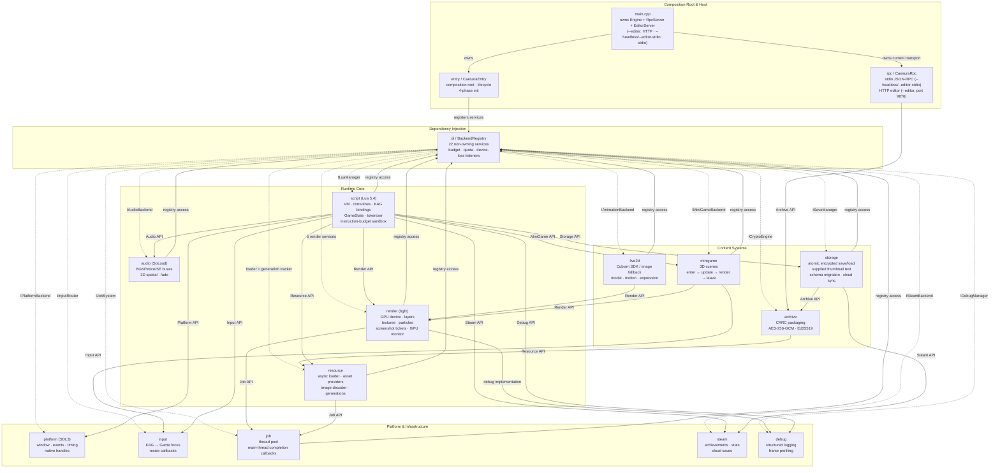

# Engine Architecture Topology (Mermaid)

当前构建由 **16 个内部静态库**（15 个子系统 + `CaesuraEntry`）和
**15 个 API `INTERFACE` target** 组成，最终统一链接到单一应用程序。
下图中实线表示当前源码/CMake 的直接模块依赖，虚线表示
`BackendRegistry` 保存的非拥有运行时服务关系；两者不是同一种依赖。



为保持图可读，`CaesuraEntry` 对各 Engine 后端的所有权/链接边汇总在 `engine`
节点中，未逐条重复绘制；模块间实线边与 `cmake/CaesuraModules.cmake` 一致。

## Module Descriptions

### Composition Root (main.cpp + entry/)

- **main.cpp / entry/** — The only production locations that create concrete backend objects.
- Four-phase init: `initPlatformPhase()` → `initScriptingPhase()` → `initAssetPhase()` → `initOptionalPhase()`.
- Registers Engine-owned backends into `BackendRegistry` for runtime access.
- Host code owns inbound transport adapters outside Engine and injects only callbacks or commands. `main.cpp` creates `RpcServer` for `--headless`/`--editor-stdio`; `--editor` instantiates `EditorServer` to run the HTTP editor on port 9876 (serving `web-editor/dist`).

### Dependency Injection (di/)

- **BackendRegistry** — Singleton storing 22 non-owning engine-service pointers. Runtime backend access goes through `::instance().get*()`; host transports and device-loss listeners are excluded from that count.
- **TextureBudget** — Auto-detects 6 memory tiers (128MB–4GB) and exposes the selected budget to texture management.
- **SandboxQuotaService** — Engine-owned Lua sandbox resource counting (textures, emitters, handles).
- **IDeviceLostListener** — Main-thread callback contract. Listeners release GPU handles before renderer shutdown and rebuild them after restoration.

### Runtime Core

- **render** (7 interfaces) — bgfx-based GPU rendering. IRenderDevice owns draw calls and screenshot tickets/results, ILayerManager handles BG/FG/MSG compositing, ITextureManager owns texture lifecycle, IParticleSystem handles 2D particles, IGpuMonitor reports adaptive quality, IVideoPlayer handles playback, and IMeshRenderer renders skeletal/mesh scenes (SMA).
- **script** (1 interface) — Lua 5.4 VM with instruction-budget sandbox. KAG tokenizer and coroutine scheduler. Bindings span 11 modules (KAG, Render, VFX, Debug, DevCore, MiniGame, Sma, Steam, Save, AI, Engine) that register the `KAG`/`Render`/`VFX`/`Debug`/`DevCore`/`mini_game`/`sma`/`steam`/`AI`/`Engine` Lua APIs.
- **audio** (1 interface) — SoLoud 3-bus audio. BGM (cross-fade), Voice (interrupt), SE (2D/3D spatial), per-bus volume, and playback position queries.
- **resource** (3 interfaces) — Asset-provider chain, Engine-owned asset manager, asynchronous loading, worker-thread image decoding, and resource-generation tracking.

### Content Systems

- **live2d** (1 interface) — Animation backend abstraction. Live2DBackend is conditionally added when Cubism 5 SDK is available; NullAnimationBackend provides static-image fallback.
- **minigame** (1 interface) — 3D mini-game framework with enter/update/render/leave lifecycle. The current Engine loop invokes update and render on the main thread.
- **storage** (2 interfaces) — JSON save/load with AES-256-GCM encryption, schema migration, and local/cloud provider abstraction.
- **archive** (3 interfaces) — CARC archive format with AES-256-GCM encryption, Ed25519 signing, reader/writer, and key management.

### Platform & Infrastructure

- **platform** (1 interface) — SDL3 window, event polling, timing, and native window handles.
- **input** (1 interface) — SDL event router with KAG/Game focus switching.
- **job** (1 interface) — Multi-threaded task system with priority and main-thread `onComplete` callbacks. NullJobSystem is the synchronous test implementation.
- **steam** (1 interface) — Steamworks achievements, stats, and cloud saves; the real SDK backend is conditionally compiled.
- **rpc** (3 interfaces: IRpcServer, IEditorServer, IRpcDispatcher) — Host-owned inbound transport adapters. Stdio JSON-RPC runs for `--headless`/`--editor-stdio`; `--editor` starts the HTTP editor on port 9876. Both dispatch through the shared `IRpcDispatcher` (owner-thread queue pumped each frame).
- **debug** (1 interface) — Structured logging, frame profiling, subsystem stats, and GPU submit tracking.

## Game Frame Data Flow

```
Engine::processEvents() → Steam callbacks / overlay gate → SDL3 events → InputRouter
  → Lua coroutine resume
  → scheduler.run() processes tokens
  → KAG commands dispatch to C++ bindings
  → BackendRegistry.get*() → concrete backend calls

Per frame:
  1. processEvents() → Steam callbacks, overlay gate, SDL/Input routing
  2. consumeDeviceLost() → recover before any frame work when required
  3. HotReload check → JobSystem callbacks → AsyncLoader completion polling
  4. Lua memory/instruction checks → GPU monitor → engine_update(dt)
  5. voice-complete edge detection → Lua callback
  6. render() → beginFrame → engine_render / Live2D / debug overlay / active mini-game render
     → commit_frame finalizes postfx and view state without advancing bgfx
  7. Optional export screenshot ticket → presentFrame()
     → advanceFrame submits screenshot readback and advances once → platform.postFrame()
  8. Optional export consumes its completed ticket; active mini-game CPU update follows presentation
```

The mini-game draw pass and postfx finish before the single normal presentation; the existing CPU mini-game update remains after presentation. `renderOneFrame` and RPC capture use the same render/present boundary. Shutdown retains explicit resource-destruction drains while screenshot admission is closed.

For `[save]`, Script freezes the slot/state/scene/cursor and uses an Operation plus a Lua 5.4 closing guard to await its own renderer ticket. `Pending` is retained across zero-value yields; terminal results are consumed once. Cancellation or owner replacement retires the ticket and prevents a late slot write. Only the resulting Base64 text and frozen state reach Storage's existing atomic/encrypted save path. Storage has no GPU-readiness or screenshot-file ownership. See the [screenshot API](../api/cpp-interfaces.md#111-irenderdevice) and [Lua save contract](../api/lua-modules.md#save-registered-on-the-kag-module).
